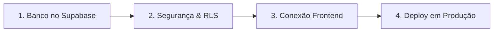

# Backlog Técnico & Guia de Produção — Guaramo Arte

> **Objetivo:** Guia e backlog definitivo para conectar os formulários de cadastro (**Beneficiários** e **Colaboradores/Voluntários**) ao **Supabase** e publicar a plataforma Guaramo Arte em ambiente de produção seguro.
> 
> 💡 **Guia Pré-Backlog:** Para o passo a passo de como criar a conta, o projeto e obter as chaves no Supabase antes de mexer no código, consulte o arquivo [`GUIA_SUPABASE_SETUP.md`](./GUIA_SUPABASE_SETUP.md).

---

## 🗺️ Roadmap de Produção em 4 Etapas



---

## 🗄️ Etapa 1: Banco de Dados & Modelagem no Supabase

### 1.1 Script SQL Completo (Copiar e Executar no Supabase)
Acesse no painel do Supabase: **SQL Editor** > **New Query**, cole o script abaixo e execute (**Run**):

```sql
-- 1. Habilitar extensão para geração automática de UUID
CREATE EXTENSION IF NOT EXISTS "uuid-ossp";

-- 2. Tabela de Beneficiários (Pessoas solicitando acolhimento)
CREATE TABLE IF NOT EXISTS public.beneficiarios (
    id UUID PRIMARY KEY DEFAULT gen_random_uuid(),
    nome VARCHAR(150) NOT NULL,
    email VARCHAR(150) NOT NULL,
    telefone VARCHAR(30) NOT NULL,
    area_ajuda VARCHAR(50) NOT NULL,
    status_atendimento VARCHAR(30) DEFAULT 'novo',
    observacoes_internas TEXT NULL,
    created_at TIMESTAMPTZ DEFAULT now()
);

-- 3. Tabela de Colaboradores / Voluntários
CREATE TABLE IF NOT EXISTS public.colaboradores (
    id UUID PRIMARY KEY DEFAULT gen_random_uuid(),
    nome VARCHAR(150) NOT NULL,
    email VARCHAR(150) NOT NULL,
    telefone VARCHAR(30) NOT NULL,
    area_interesse VARCHAR(50) NOT NULL,
    status VARCHAR(30) DEFAULT 'pendente',
    observacoes_internas TEXT NULL,
    created_at TIMESTAMPTZ DEFAULT now()
);

-- 4. Habilitar Segurança por Linha (Row Level Security - RLS)
ALTER TABLE public.beneficiarios ENABLE ROW LEVEL SECURITY;
ALTER TABLE public.colaboradores ENABLE ROW LEVEL SECURITY;

-- 5. Políticas de Acesso Seguro:
-- 5.1 Permitir que qualquer visitante anônimo envie seu cadastro via formulário
CREATE POLICY "Permitir envio publico de beneficiario"
    ON public.beneficiarios
    FOR INSERT
    TO anon
    WITH CHECK (true);

CREATE POLICY "Permitir envio publico de colaborador"
    ON public.colaboradores
    FOR INSERT
    TO anon
    WITH CHECK (true);

-- 5.2 Proteger dados sensíveis: apenas administradores autenticados da ONG podem consultar
CREATE POLICY "Apenas equipe autenticada le beneficiarios"
    ON public.beneficiarios
    FOR SELECT
    TO authenticated
    USING (true);

CREATE POLICY "Apenas equipe autenticada le colaboradores"
    ON public.colaboradores
    FOR SELECT
    TO authenticated
    USING (true);
```

### 1.2 Obtenção das Chaves de API
No painel do projeto no Supabase:
1. Vá em **Project Settings** (ícone de engrenagem) > **API**.
2. Copie:
   - **Project URL** (ex: `https://xyzproject.supabase.co`)
   - **anon / public key** (chave JWT longa pública iniciada com `eyJ...`)

- [ ] Executar o script SQL no Supabase.
- [ ] Guardar com segurança a Project URL e a anon/public key.

---

## 🔒 Etapa 2: Segurança, LGPD & Permissões

- [ ] **Políticas RLS ativas:** Garantir que nenhuma chave pública no frontend permita listar dados de migrantes ou voluntários (`SELECT` bloqueado para `anon`).
- [ ] **Consentimento LGPD nos formulários:**
  - Adicionar checkbox de aceite de dados no formulário em `index.html`:
    `"Autorizo o contato da equipe da Guaramo Arte para fins de acolhimento e assistência."`
- [ ] **Mecanismo Anti-Spam (Honeypot):**
  - Adicionar campo oculto (`display: none`) no formulário; se preenchido por robôs, descartar silenciosamente o envio.

---

## ⚡ Etapa 3: Integração do Frontend com o Supabase

A plataforma Guaramo utiliza Vanilla JS com ES Modules nativos (sem necessidade de bundlers complexos como Vite ou Webpack).

### 3.1 Arquivos a criar e modificar:

- [ ] **Criar `js/modules/supabaseClient.js`**:
  ```javascript
  import { createClient } from 'https://esm.sh/@supabase/supabase-js@2';

  const SUPABASE_URL = 'SUA_PROJECT_URL_AQUI';
  const SUPABASE_ANON_KEY = 'SUA_ANON_KEY_AQUI';

  export const supabase = createClient(SUPABASE_URL, SUPABASE_ANON_KEY);
  ```

- [ ] **Atualizar `js/modules/registration.js`**:
  - Importar `supabase` de `./supabaseClient.js`.
  - No `handleFormSubmit`:
    ```javascript
    const tabela = tipo === 'beneficiario' ? 'beneficiarios' : 'colaboradores';
    const payload = tipo === 'beneficiario'
      ? { nome: dataObj.nome, email: dataObj.email, telefone: dataObj.telefone, area_ajuda: dataObj.area_ajuda }
      : { nome: dataObj.nome, email: dataObj.email, telefone: dataObj.telefone, area_interesse: dataObj.area_interesse };

    const { data, error } = await supabase.from(tabela).insert([payload]);
    if (error) throw error;
    ```
  - Exibir feedback visual de sucesso ou erro amigável ao usuário.

---

## 🚀 Etapa 4: Otimização Pré-Produção & Deploy

- [ ] **Otimização de Imagens (Redução de Banda):**
  - Converter imagens em `images/` de PNG pesado para **WebP** (`hero-fundo.png` 1.3MB, `colab.png` 2.6MB, `oficina.png` 2.3MB). Reduz em ~70% o tempo de abertura em conexões 3G/4G.
- [ ] **Metatags de Redes Sociais (Open Graph):**
  - Configurar `og:title`, `og:description`, `og:image` no `index.html` para exibição correta ao compartilhar no WhatsApp e Instagram.
- [ ] **Hospedagem & Domínio:**
  - Escolher provedor de hospedagem de frontend estático com CDN e SSL (Vercel, Netlify, Cloudflare Pages ou GitHub Pages).
  - Conectar repositório Git para deploy contínuo automático.
  - Apontar domínio próprio (`guaramoarte.org`).
- [ ] **Testes de Validação Ponta a Ponta:**
  - Teste de cadastro no celular e no computador.
  - Verificação dos registros inseridos na tabela no painel do Supabase (Table Editor).

---

## 📊 Tabela de Acompanhamento do Projeto

| Tarefa | Responsável | Status |
| :--- | :--- | :--- |
| Modelagem SQL & Criação das Tabelas | Supabase | ⏳ Pendente de execução |
| Configuração de Políticas RLS | Supabase | ⏳ No script SQL |
| Cliente Supabase no Frontend (`supabaseClient.js`) | Frontend | ⏳ Pronto para criar |
| Conexão do Formulário de Cadastro (`registration.js`) | Frontend | ⏳ Pronto para integrar |
| Otimização de Imagens (WebP) | Frontend | ⏳ Pendente |
| Publicação & Deploy em Produção | DevOps / Hosting | ⏳ Fase final |

---

*Arquivo mantido na raiz do projeto: [`BACKLOG.md`](./BACKLOG.md).*
